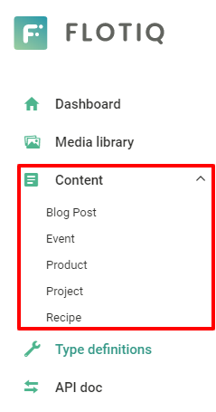
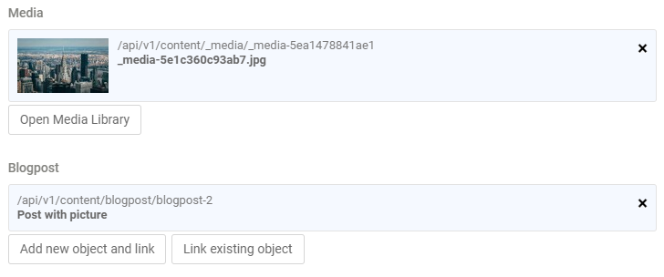
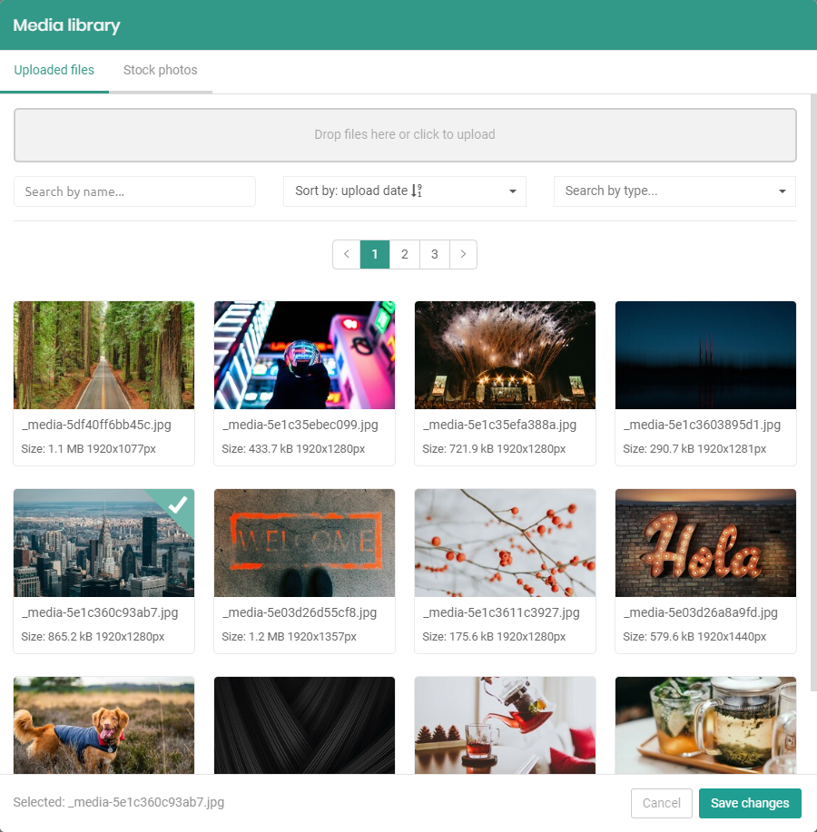
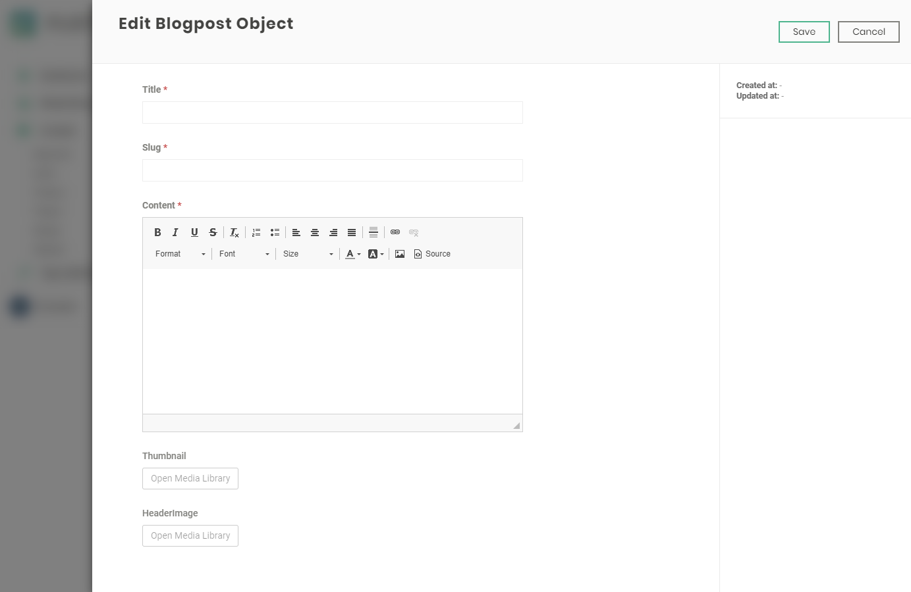
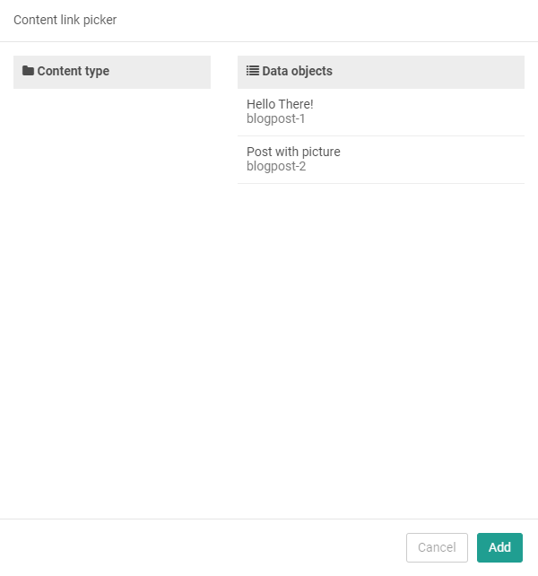
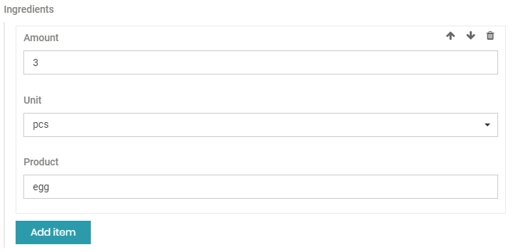
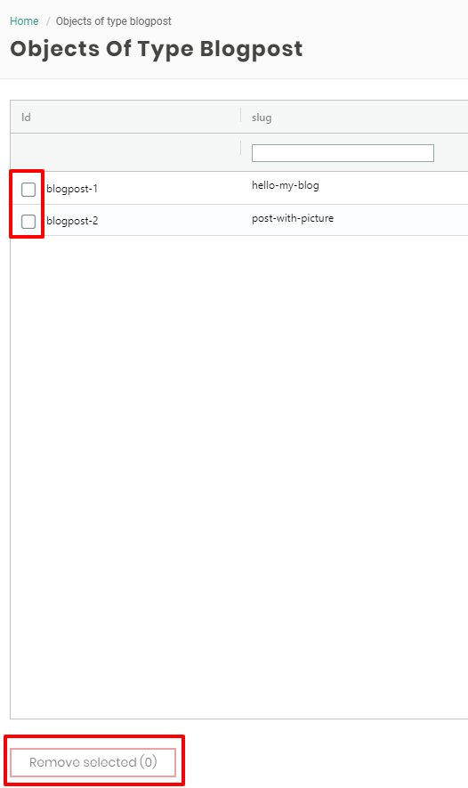

# Content Objects

Once a Content Type has been defined in the system - the user can create Content Objects of that Content Type. This is done either directly through the API or via the convenient Content Entry tools provided within the [Flotiq Dashboard](https://editor.flotiq.com){:target="_blank"}. 

## Authoring content

The Content Entry component consists of two elements - content browser and the content editor.

Click tile on the Type Definitions to go to the content browser page:

{: .center .width75 .border}

or entry in the left menu:

{: .center .border}

To quickly browse and search through large amounts of data, the content browser provides a convenient grid interface. Users can customize the grid according to their preferences:

{: .center .width75 .border}

From the grid, the users can go to the form that allows them to edit particular Content Objects:

{: .center .width75 .border}

The form view also displays information about previous versions of a particular Content Object. From this view, you can also switch to older revisions. To save older revision, click on the version tile, and then click the 'Save' button.

### Relations

Flotiq has two types of relations in dashboard (they are managed in the same way in the json object):

{: .center .width75 .border}

* Media - opens Media Library, where you can add new files or select the ones already added.

    {: .center .width75 .border}
    
    To add media object, click on the desired file, and then 'Save changes' button. Newly uploaded files are automatically selected, you only need to click the 'Save changes' button.

* Object - where you can either open form for object creation using 'Add new object and link' button:

    {: .center .width75 .border}
    
    After saving the object, the system automatically links it to the object you are editing/creating right now.
    
    You can also click 'Link existing object' button and link object created earlier:
    
    {: .center .width75 .border}
    
    To add the object, click on the desired object, and then the 'Add' button.

If you want to remove the linked object, click the 'X' icon on the right side of the object.

!!! note    
    For now, you can only add one object or file at a time. You can't change the order of the objects in relations.

### Lists

If the object has list property, Flotiq generates series of sub-forms with properties described in such list:

{: .center .width75 .border}

To add the new object to the list click 'Add item' button. You can change the order of objects in the list using up and down arrow in the top right corner of object form. You can remove the object from the list using trash icon in the top right corner of object form.

## Deleting content

You can delete object either by clicking 'Delete' button on edit object page (in the top right corner):

{: .center .border}

Or by selecting it on the content browser, and clicking 'Remove selected' button:

{: .center .border}

!!! warning
    You can only remove objects that are not linked to any other object in the system.
